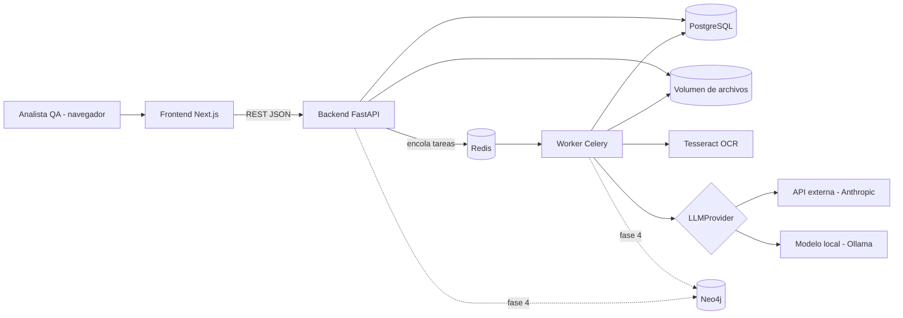

# Especificación Técnica — Copiloto de Certificación QA (Beyond Health)

Versión 1.0 — Documento de referencia para el desarrollo. Complementa a `CLAUDE.md`.
Si hay conflicto entre ambos, prevalecen las reglas de seguridad de `CLAUDE.md`.

---

## 1. Visión

Herramienta web que reduce el tiempo y el retrabajo del ciclo de certificación QA de Beyond Health. Toma un documento de requerimiento y una base de usuarios de prueba, y produce: preguntas sobre ambigüedades, casos de prueba claros, asignación de usuarios de prueba a cada caso, validación de evidencias y entregables listos (CO-FR-VRA-03, nota TFS, correo). Cada certificación alimenta un grafo de conocimiento del sistema (Mapa Vivo) y registra métricas.

### 1.1 Objetivos medibles

| Objetivo | Métrica |
|---|---|
| Reducir tiempo por certificación | Horas desde creación hasta entregables generados |
| Reducir tiempo buscando datos | Minutos desde carga de base hasta asignación confirmada |
| Automatizar selección de datos | % de casos con usuario asignado sin intervención manual |
| Detectar ambigüedades antes de probar | Ambigüedades detectadas y resueltas por requerimiento |
| Reducir retrabajo | Casos o certificaciones devueltas |
| Evidencia completa | Pantallazos rechazados por OCR antes de entregar |

### 1.2 Alcance

**Incluido (MVP, fases 0–3):** gestión de certificaciones, análisis de requerimientos, detector de ambigüedades, redacción y linter de casos, carga y mapeo de bases de usuarios, asignación automática, carga y validación OCR de evidencias, generación de CO-FR-VRA-03, nota TFS y correo, métricas por etapa.

**Fases posteriores:** Mapa Vivo (Neo4j), sugerencia de regresión, piloto multiusuario, tablero de métricas avanzado.

**Fuera de alcance:** conexión directa a Beyond Health, ejecución automática de servicios SOAP, creación directa de ítems en TFS/Aranda, lectura directa de Arkitect. (Pueden evaluarse después si hay permisos.)

### 1.3 Usuarios y roles

| Rol | Permisos |
|---|---|
| `analyst` | Crea y gestiona sus certificaciones, mapeos y plantillas personales |
| `lead` | Todo lo de analista + ver certificaciones y métricas de todo el equipo, gestionar plantillas globales |
| `admin` | Gestión de usuarios y configuración del sistema |

En el piloto hay un solo usuario, pero el modelo soporta varios desde el inicio.

---

## 2. Requerimientos funcionales

Cada requerimiento tiene un identificador `RF-XX` que debe citarse en los commits y tests relacionados.

### 2.1 Certificaciones

- **RF-01** Crear una certificación con: tipo (`bug` | `brecha`), código externo (ej. IM-9142664, número de bug TFS, número de brecha), módulo de Beyond Health, título y descripción corta.
- **RF-02** Una certificación avanza por etapas: `requirement` → `ambiguities` → `testcases` → `testdata` → `execution` → `deliverables` → `closed`. Se puede volver a etapas anteriores.
- **RF-03** Listar, filtrar (tipo, módulo, estado, fecha) y buscar certificaciones.
- **RF-04** Registrar automáticamente el inicio y fin de cada etapa (métricas).

### 2.2 Módulo 1 — Requerimiento y casos de prueba

- **RF-10** Subir documento de requerimiento en `.docx` o `.pdf`. Para bugs, permitir pegar texto del caso Aranda en lugar de documento.
- **RF-11** Extraer el texto por secciones, conservando títulos y numeración de pasos.
- **RF-12** Extraer criterios de aceptación estructurados (id, texto, sección de origen).
- **RF-13** Detectar ambigüedades (ver §6.3). Cada hallazgo tiene: tipo, fragmento, ubicación, explicación y pregunta sugerida.
- **RF-14** El analista registra la resolución de cada ambigüedad (respuesta + quién la dio). Las resoluciones se incluyen como contexto al generar casos.
- **RF-15** Generar casos de prueba con la plantilla estricta (ver §6.4), cada uno ligado a uno o más criterios.
- **RF-16** Permitir importar casos ya existentes (pegar texto o Excel) en lugar de generarlos.
- **RF-17** Linter de redacción que marca incumplimientos de las reglas en cada caso.
- **RF-18** Editar, reordenar, eliminar y aprobar casos. Solo los casos aprobados pasan a la etapa de datos.
- **RF-19** Matriz de trazabilidad criterio ↔ caso, con alerta de criterios sin caso.

### 2.3 Módulo 2 — Datos de prueba

- **RF-20** Subir base de usuarios en `.xlsx`, `.xls`, `.csv` o `.txt` (detectar delimitador: `|`, `;`, `,`, tabulación).
- **RF-21** Vista previa de las primeras filas y detección de tipos de columna (texto, número, fecha).
- **RF-22** Mapeo de columnas a campos de dominio (ver §6.5): propuesta automática + confirmación del analista. Guardar el mapeo con una huella del encabezado para reutilizarlo.
- **RF-23** Traducir cada caso aprobado a condiciones estructuradas (DSL de §6.6), con confirmación del analista.
- **RF-24** Filtrar candidatos por caso de forma determinística y local.
- **RF-25** Asignar un usuario distinto por caso más hasta 2 suplentes, optimizando según §6.7.
- **RF-26** Mostrar la justificación de cada asignación (valores que cumplen cada condición).
- **RF-27** Calcular valores de entrada derivados (ej. fecha de efecto = fecha inicio IPS − 1 día), soportando días hábiles con festivos de Colombia.
- **RF-28** Si un caso no tiene candidatos, generar texto de solicitud de datos con las condiciones exactas.
- **RF-29** Permitir reemplazar manualmente un usuario asignado.

### 2.4 Ejecución y evidencias

- **RF-30** Generar el paso a paso de cada caso con los datos asignados, en el estilo definido.
- **RF-31** Subir uno o varios pantallazos por caso (png, jpg). Permitir pegar desde el portapapeles.
- **RF-32** Validar cada pantallazo con OCR: debe contener hora del sistema y URL (ver §6.8). Marcar como válido, advertencia o rechazado.
- **RF-33** Registrar resultado por caso: `passed` | `failed` | `blocked`, con observación.
- **RF-34** Generar descripción de evidencia por caso en el estilo "Se muestra ...".

### 2.5 Entregables

- **RF-40** Generar el CO-FR-VRA-03 llenando una plantilla base (ver §6.9). El formato nunca se altera.
- **RF-41** Generar nota TFS en texto listo para copiar.
- **RF-42** Generar correo de certificación (asunto + cuerpo) listo para copiar.
- **RF-43** Descargar un `.zip` con los entregables y evidencias.
- **RF-44** Todos los textos generados son editables antes de exportar.

### 2.6 Métricas

- **RF-50** Registrar eventos por etapa (inicio, fin, duración) y contadores (ambigüedades, casos, % autoasignación, rechazos OCR, devoluciones).
- **RF-51** Permitir registrar manualmente una devolución (certificación o caso devuelto y motivo).
- **RF-52** Permitir registrar certificaciones de línea base (hechas sin la herramienta) con su duración, para comparar.
- **RF-53** Tablero con promedios por tipo y módulo, y comparación contra la línea base. Exportable a Excel.

### 2.7 Mapa Vivo (fase 4)

- **RF-60** Al cerrar una certificación, registrar en el grafo: módulo, funcionalidades, reglas de validación, mensajes de error, casos y resultados.
- **RF-61** Consultar el grafo en lenguaje natural y con filtros (ej. "reglas que afectan exclusión de beneficiario").
- **RF-62** Sugerir casos de regresión para una nueva certificación según módulos y reglas relacionados.
- **RF-63** Glosario de términos del dominio usado por el linter para asegurar terminología consistente.

---

## 3. Requerimientos no funcionales

- **RNF-01 Privacidad:** los datos de afiliados nunca salen de la VM ni se envían a un LLM. Verificado por tests (ver §9).
- **RNF-02 Portabilidad:** todo corre con `docker compose up` en una VM Linux.
- **RNF-03 Proveedor de IA intercambiable:** cambiar entre API externa y modelo local solo con variables de entorno.
- **RNF-04 Rendimiento:** filtrado y asignación sobre bases de hasta 50.000 filas en menos de 5 s. Operaciones con LLM u OCR son asíncronas con indicador de progreso.
- **RNF-05 Trazabilidad:** registro de auditoría de acciones relevantes (subidas, aprobaciones, exportaciones).
- **RNF-06 Retención:** bases de usuarios y evidencias se eliminan automáticamente N días después de cerrar la certificación (configurable, por defecto 30).
- **RNF-07 Idioma:** interfaz y documentos generados en español; código en inglés.
- **RNF-08 Calidad de código:** tipado estricto, linters y cobertura mínima de 80 % en lógica de dominio.

---

## 4. Arquitectura

### 4.1 Vista general



### 4.2 Estilo

Monolito modular. Cada módulo de dominio tiene sus propias capas y solo se comunica con otros módulos a través de sus servicios públicos (nunca accediendo a modelos ajenos directamente).

Capas por módulo:

```
<modulo>/
  router.py      # endpoints FastAPI (sin lógica de negocio)
  schemas.py     # modelos Pydantic de entrada/salida
  models.py      # modelos SQLAlchemy
  service.py     # lógica de negocio (orquestación)
  repository.py  # acceso a datos
  tasks.py       # tareas Celery (si aplica)
  domain/        # lógica pura sin I/O (reglas, algoritmos) — la más testeada
```

### 4.3 Componentes

| Componente | Responsabilidad |
|---|---|
| Frontend | Interfaz tipo asistente por etapas, tablero de métricas |
| Backend API | Autenticación, CRUD, orquestación, encolado de tareas |
| Worker | Extracción de documentos, llamadas LLM, OCR, generación de entregables |
| PostgreSQL | Datos transaccionales, métricas, auditoría |
| Redis | Broker de Celery y caché |
| Volumen de archivos | Documentos, bases, evidencias, entregables (fuera de la BD) |
| Neo4j (fase 4) | Mapa Vivo |
| Ollama (opcional) | Modelo local si la política no permite API externa |

---

## 5. Stack tecnológico

Usar la última versión estable de cada librería dentro de la versión mayor indicada.

### 5.1 Backend

| Tecnología | Uso |
|---|---|
| Python 3.12 | Lenguaje |
| FastAPI | API REST |
| Pydantic v2 + pydantic-settings | Validación y configuración |
| SQLAlchemy 2 (async) + asyncpg | ORM |
| Alembic | Migraciones |
| Celery 5 + Redis 7 | Tareas asíncronas |
| python-docx, pdfplumber | Lectura de requerimientos |
| pandas, openpyxl, xlrd | Lectura de bases y escritura de la plantilla Excel |
| scipy | Asignación óptima (`linear_sum_assignment`) |
| holidays | Festivos de Colombia para días hábiles |
| pytesseract + Pillow + OpenCV | OCR y preprocesamiento de pantallazos |
| Jinja2 | Plantillas de nota TFS y correo |
| anthropic, httpx | Proveedores LLM (API externa y Ollama) |
| argon2-cffi, PyJWT | Contraseñas y tokens |
| structlog | Logging estructurado |
| neo4j (driver) | Fase 4 |

### 5.2 Frontend

| Tecnología | Uso |
|---|---|
| Node 22 + Next.js 15 (App Router) + TypeScript | Aplicación |
| Tailwind CSS + shadcn/ui | Estilos y componentes |
| TanStack Query | Estado del servidor |
| React Hook Form + Zod | Formularios y validación |
| TanStack Table | Tablas (casos, candidatos, matriz) |
| Recharts | Gráficas de métricas |
| openapi-typescript | Tipos generados desde el OpenAPI del backend |

### 5.3 Infraestructura y calidad

| Tecnología | Uso |
|---|---|
| Docker + Docker Compose | Despliegue en VM |
| Caddy | Proxy inverso y HTTPS en la VM |
| ruff, mypy (strict) | Lint y tipado backend |
| ESLint, Prettier | Lint frontend |
| pytest, pytest-asyncio, httpx, factory-boy | Tests backend |
| Vitest, Playwright | Tests frontend y end-to-end |
| pre-commit | Hooks locales |
| gitleaks | Evitar secretos en commits |

---

## 6. Diseño detallado

### 6.1 Estructura del repositorio

```
copiloto-certificacion/
  CLAUDE.md
  docs/
    SPEC.md
    adr/                     # decisiones de arquitectura (ADR-001, ...)
  backend/
    app/
      main.py
      core/                  # config, db, security, logging, storage, audit
      llm/                   # provider.py, anthropic_provider.py, ollama_provider.py, fake_provider.py, prompts/
      users/
      certifications/
      requirements/
      testcases/
      testdata/
      evidence/
      deliverables/
      metrics/
      knowledge/             # fase 4
    alembic/
    tests/
      unit/
      integration/
      fixtures/              # SOLO datos sintéticos
    pyproject.toml
    Dockerfile
  frontend/
    src/app/                 # rutas
    src/components/
    src/lib/api/             # cliente y tipos generados
    Dockerfile
  templates/
    co-fr-vra-03/            # plantilla base + mapping.yaml
    tfs_note.md.j2
    email.md.j2
  infra/
    docker-compose.yml
    docker-compose.dev.yml
    Caddyfile
  scripts/                   # seed, generar fixtures sintéticos, purga
  .env.example
  .gitignore
  .pre-commit-config.yaml
```

### 6.2 Capa LLM

```python
class LLMProvider(Protocol):
    async def complete(self, system: str, messages: list[Message], *, max_tokens: int) -> str: ...
    async def structured(self, system: str, messages: list[Message], schema: type[BaseModel]) -> BaseModel: ...
```

- Implementaciones: `AnthropicProvider`, `OllamaProvider`, `FakeProvider` (tests, respuestas fijas).
- Selección por `LLM_PROVIDER=anthropic|ollama|fake`.
- `structured()` pide JSON, valida con Pydantic y reintenta hasta 2 veces con el error de validación como contexto.
- Prompts versionados como archivos en `llm/prompts/` (ej. `extract_criteria.v1.md`). La versión usada se guarda junto al resultado.
- **Guardia de privacidad:** antes de enviar, `PIIGuard` revisa el texto con expresiones regulares (números de documento de 6–10 dígitos, correos, teléfonos) y bloquea el envío si encuentra coincidencias no permitidas. Los documentos de requerimiento pueden contener ejemplos con datos reales: en ese caso se enmascaran (`[DOC_1]`) y se registra la advertencia.
- Cada llamada se registra (módulo, prompt, versión, tokens, duración) sin guardar el contenido enviado.

### 6.3 Detector de ambigüedades

Enfoque híbrido:

1. **Reglas locales** (`requirements/domain/ambiguity_rules.py`): léxico de comparadores ("mayor", "menor", "anterior", "posterior", "hasta", "desde", "a partir de", "superior", "inferior"), unidades de tiempo sin calificador ("días" sin "hábiles"/"calendario"), cuantificadores vagos ("algunos", "según corresponda").
2. **LLM** para lo semántico: ramas faltantes, contradicciones entre secciones, condiciones sin resultado definido.
3. Se combinan y deduplican por ubicación.

Tipos: `boundary_undefined`, `implicit_unit`, `missing_branch`, `contradiction`, `vague_term`, `undefined_result`.

### 6.4 Plantilla y linter de casos

Estructura de un caso:

```json
{
  "code": "CP-01",
  "name": "Validar que el sistema rechace la exclusión de beneficiario cuando la fecha de efecto es anterior a la fecha de inicio de la IPS vigente",
  "criteria_ids": ["CA-02"],
  "preconditions": ["Afiliado beneficiario con contrato activo", "Fecha fin de contrato vacía"],
  "steps": ["..."],
  "expected_result": "El sistema rechaza la novedad y muestra el mensaje de validación de fechas",
  "boundary": "before"
}
```

Reglas del linter (`testcases/domain/linter.py`), cada una con código:

| Código | Regla |
|---|---|
| L01 | El nombre empieza con "Validar que el sistema" |
| L02 | El nombre contiene exactamente una condición ("cuando ...") sin "y" que una dos condiciones |
| L03 | Sin palabras vagas: correctamente, adecuadamente, de forma exitosa, etc. |
| L04 | Un solo resultado esperado, observable |
| L05 | Términos consistentes con el glosario |
| L06 | Nombre de máximo 200 caracteres |
| L07 | Si hay comparación, existen los casos de frontera anterior/igual/posterior |
| L08 | Todo criterio tiene al menos un caso |

### 6.5 Campos de dominio y mapeo de columnas

Tabla `domain_fields` extensible. Campos iniciales del módulo piloto:

`document_type`, `document_number`, `full_name`, `contract_number`, `affiliate_role` (titular/beneficiario), `contract_status`, `contract_start_date`, `contract_end_date`, `ips_start_date`, `ips_end_date`, `contributor_type`, `has_beneficiaries`, `employer_id`, `affiliation_date`.

Mapeo:

1. Se calcula la huella del encabezado (hash de nombres de columna normalizados).
2. Si existe un mapeo guardado con esa huella, se propone directamente.
3. Si no, se propone por similitud de nombres (normalización + sinónimos) y, si hay dudas, con el LLM, enviando **solo los nombres de columna y el tipo detectado, nunca valores**.
4. El analista confirma y se guarda.

### 6.6 DSL de condiciones

```json
{
  "case_code": "CP-01",
  "conditions": [
    {"field": "affiliate_role", "op": "eq", "value": "beneficiario"},
    {"field": "contract_status", "op": "eq", "value": "activo"},
    {"field": "contract_end_date", "op": "is_null"},
    {"field": "ips_start_date", "op": "not_null"}
  ],
  "derived_inputs": [
    {"name": "fecha_efecto", "expr": {"base": "ips_start_date", "offset": -1, "unit": "calendar_days"}}
  ],
  "mutates_state": true
}
```

- Operadores: `eq`, `ne`, `in`, `not_in`, `gt`, `gte`, `lt`, `lte`, `between`, `is_null`, `not_null`, `contains`, y comparaciones entre campos (`{"field": "a", "op": "lt", "other_field": "b"}`).
- Unidades de offset: `calendar_days`, `business_days` (festivos Colombia), `months`.
- El DSL se evalúa con pandas en `testdata/domain/filter.py`. Sin `eval` ni ejecución de código generado.

### 6.7 Algoritmo de asignación

1. Para cada caso, obtener candidatos que cumplen todas sus condiciones.
2. Construir una matriz de costo casos × candidatos. Costo = penalizaciones por "ruido": campos que podrían disparar otras validaciones (configurable por módulo), uso previo del usuario en otras certificaciones recientes, datos incompletos. Candidato inválido = costo infinito.
3. Si algún caso tiene `mutates_state: true`, sus usuarios no se comparten con ningún otro caso (en la práctica, todos distintos por defecto).
4. Resolver con `scipy.optimize.linear_sum_assignment`.
5. Suplentes: los 2 siguientes candidatos de menor costo no asignados.
6. Casos sin solución → generar solicitud de datos (RF-28).
7. Todo el proceso es local y determinístico: misma entrada, misma salida.

### 6.8 Validación OCR de evidencias

1. Preprocesar imagen (escala de grises, aumento de contraste, binarización).
2. OCR con Tesseract (`spa+eng`).
3. Buscar hora: regex de `HH:MM` o `HH:MM:SS`, con o sin a.m./p.m. Ubicación esperada: zona inferior derecha (reloj del sistema) — se revisa primero ese recorte.
4. Buscar URL: regex de `http(s)://` o dominio, priorizando la franja superior (barra del navegador).
5. Resultado: `valid` (ambas), `warning` (una sola o baja confianza), `rejected` (ninguna). El analista puede aceptar una advertencia con justificación.
6. El texto OCR no se envía al LLM (puede contener datos de afiliados).

### 6.9 Plantilla CO-FR-VRA-03

- La plantilla oficial vacía se guarda en `templates/co-fr-vra-03/template.xlsx` (no se versiona si contiene datos internos; en ese caso se carga desde la interfaz como plantilla global).
- `mapping.yaml` define celdas y regiones:

```yaml
fields:
  requirement_code: {sheet: "Pruebas", cell: "C5"}
  module: {sheet: "Pruebas", cell: "C6"}
  analyst: {sheet: "Pruebas", cell: "C7"}
  date: {sheet: "Pruebas", cell: "C8", format: "dd/mm/yyyy"}
tables:
  test_cases:
    sheet: "Pruebas"
    start_row: 12
    columns: {code: "A", name: "B", steps: "C", expected_result: "D", result: "E"}
images:
  evidence:
    sheet: "Evidencias"
    layout: "one_per_block"
    start_cell: "A3"
    caption_offset_rows: -1
```

- Las celdas y hojas reales se definen al tener la plantilla; el mapeo es configurable desde la interfaz sin tocar código.
- Solo se escriben valores; se preservan estilos, fórmulas y celdas combinadas.

### 6.10 Nota TFS y correo

Plantillas Jinja2 con las variables de la certificación. Opcionalmente, el LLM ajusta la redacción para que sea breve y directa, sin agregar información que no esté en la certificación (se valida que no introduzca números o códigos nuevos).

---

## 7. Modelo de datos (PostgreSQL)

Todas las tablas tienen `id` (UUID), `created_at`, `updated_at`.

| Tabla | Campos principales |
|---|---|
| `users` | email, full_name, password_hash, role, is_active |
| `certifications` | owner_id, type, external_code, module, title, description, stage, status, closed_at |
| `stage_events` | certification_id, stage, started_at, ended_at |
| `requirement_documents` | certification_id, file_path, file_name, mime_type, extracted_text, sections (JSONB) |
| `acceptance_criteria` | certification_id, code, text, source_section |
| `ambiguities` | certification_id, type, fragment, location, explanation, question, resolution, resolved_by, resolved_at |
| `test_cases` | certification_id, code, name, preconditions (JSONB), steps (JSONB), expected_result, boundary, status (draft/approved), lint_results (JSONB), order |
| `test_case_criteria` | test_case_id, criterion_id |
| `case_conditions` | test_case_id, conditions (JSONB), derived_inputs (JSONB), mutates_state, confirmed |
| `user_bases` | certification_id, file_path, header_fingerprint, row_count, mapping_id, purge_after |
| `column_mappings` | owner_id, header_fingerprint, mapping (JSONB), module, is_global |
| `domain_fields` | key, label, data_type, module, synonyms (JSONB) |
| `assignments` | test_case_id, user_base_id, row_ref, rank (0 = principal, 1–2 suplentes), cost, justification (JSONB), derived_values (JSONB), manual_override |
| `data_requests` | certification_id, test_case_id, text |
| `executions` | test_case_id, result, observation, executed_at |
| `evidences` | test_case_id, file_path, ocr_status, ocr_time_found, ocr_url_found, accepted_with_reason, caption |
| `deliverables` | certification_id, kind (co_fr_vra_03/tfs_note/email/zip), file_path, content, generated_at |
| `templates` | kind, name, file_path, mapping (JSONB), is_global, owner_id |
| `rework_events` | certification_id, test_case_id, reason, reported_at |
| `baseline_certifications` | owner_id, type, module, duration_minutes, date, notes |
| `llm_calls` | module, prompt_name, prompt_version, provider, tokens_in, tokens_out, duration_ms, success |
| `audit_log` | user_id, action, entity, entity_id, metadata (JSONB) |

Notas:
- `assignments.row_ref` guarda el índice de fila en la base; los datos del afiliado se leen del archivo cuando se necesitan y no se duplican en tablas.
- Al purgar una base (RNF-06), se borra el archivo y se conserva solo la justificación anonimizada para métricas.

---

## 8. API REST

Prefijo `/api/v1`. Autenticación con JWT en cookie httpOnly. OpenAPI disponible en `/api/docs` solo en desarrollo.

| Método y ruta | Descripción |
|---|---|
| `POST /auth/login`, `POST /auth/logout`, `GET /auth/me` | Sesión |
| `GET/POST /certifications`, `GET/PATCH /certifications/{id}` | CRUD |
| `POST /certifications/{id}/stage` | Cambiar etapa |
| `POST /certifications/{id}/requirement` | Subir documento o texto |
| `POST /certifications/{id}/requirement/analyze` | Extraer criterios y ambigüedades (tarea) |
| `GET /certifications/{id}/criteria` | Criterios |
| `GET /certifications/{id}/ambiguities`, `PATCH /ambiguities/{id}` | Ver y resolver |
| `POST /certifications/{id}/testcases/generate` | Generar casos (tarea) |
| `POST /certifications/{id}/testcases/import` | Importar casos existentes |
| `GET/POST /certifications/{id}/testcases`, `PATCH/DELETE /testcases/{id}` | CRUD casos |
| `POST /testcases/{id}/lint` | Ejecutar linter |
| `POST /testcases/{id}/approve` | Aprobar |
| `GET /certifications/{id}/traceability` | Matriz |
| `POST /certifications/{id}/userbase` | Subir base |
| `GET /userbases/{id}/preview` | Vista previa y tipos |
| `POST /userbases/{id}/mapping/suggest`, `PUT /userbases/{id}/mapping` | Mapeo |
| `POST /testcases/{id}/conditions/suggest`, `PUT /testcases/{id}/conditions` | Condiciones |
| `POST /certifications/{id}/assign` | Ejecutar asignación |
| `GET /certifications/{id}/assignments`, `PATCH /assignments/{id}` | Ver y reemplazar |
| `GET /certifications/{id}/data-requests` | Solicitudes de datos |
| `POST /testcases/{id}/evidence` | Subir pantallazo (dispara OCR) |
| `PATCH /evidence/{id}` | Aceptar advertencia, editar descripción |
| `PUT /testcases/{id}/execution` | Registrar resultado |
| `POST /certifications/{id}/deliverables/generate` | Generar entregables (tarea) |
| `GET /certifications/{id}/deliverables`, `GET /deliverables/{id}/download` | Ver y descargar |
| `GET /tasks/{task_id}` | Estado de tarea asíncrona |
| `GET /metrics/summary`, `GET /metrics/export` | Métricas |
| `POST /metrics/baseline`, `POST /metrics/rework` | Registros manuales |
| `GET/POST /templates`, `GET/POST /domain-fields` | Configuración |

Errores con formato uniforme: `{"error": {"code": "...", "message": "...", "details": {...}}}`.

---

## 9. Seguridad

- **Autenticación:** contraseñas con Argon2id; JWT de corta duración (30 min) con refresh; cookies `httpOnly`, `Secure`, `SameSite=Strict`.
- **Autorización:** por rol y por propietario en cada endpoint (un analista solo ve sus certificaciones; el líder ve todas).
- **Archivos:** validar extensión y tipo MIME real; límite de tamaño configurable (por defecto 20 MB); nombres aleatorios en disco; nunca servir archivos por ruta directa.
- **Privacidad de datos de afiliados:**
  - Nunca se envían al LLM (garantizado por `PIIGuard` y por diseño: filtrado y OCR son locales).
  - Test obligatorio `test_no_pii_reaches_llm`: ejecuta el flujo completo con `FakeProvider` espía y falla si algún valor de la base de usuarios aparece en lo enviado.
  - Purga automática según RNF-06 (tarea Celery beat diaria).
- **Secretos:** solo en `.env`; `gitleaks` en pre-commit.
- **Cabeceras:** CSP, `X-Content-Type-Options`, `X-Frame-Options` vía Caddy.
- **Auditoría:** subidas, aprobaciones, exportaciones, inicios de sesión y purgas en `audit_log`.
- **Dependencias:** `pip-audit` y `npm audit` en CI.

---

## 10. Interfaz (frontend)

| Ruta | Pantalla |
|---|---|
| `/login` | Inicio de sesión |
| `/` | Tablero: certificaciones activas, recientes y métricas rápidas |
| `/certifications/new` | Crear certificación |
| `/certifications/[id]` | Asistente por etapas con barra de progreso |
| └ Requerimiento | Subida, vista del texto por secciones, criterios extraídos |
| └ Ambigüedades | Lista con fragmento resaltado, pregunta, campo de resolución |
| └ Casos | Tabla editable, resultados del linter en línea, matriz de trazabilidad |
| └ Datos | Subida de base, mapeo de columnas, condiciones por caso, asignaciones con justificación y suplentes, solicitudes de datos |
| └ Ejecución | Paso a paso por caso, zona para pegar/soltar pantallazos, estado OCR, resultado |
| └ Entregables | Vista previa y edición de nota TFS y correo, descarga de Excel y zip |
| `/metrics` | Tablero con comparación contra línea base |
| `/settings` | Plantillas, mapeos guardados, campos de dominio, usuarios (admin) |

Principios: todo en español, acciones largas con indicador de progreso, botón "copiar" en todo texto generado, nada se exporta sin revisión del analista.

---

## 11. Estrategia de pruebas

| Nivel | Qué cubre | Herramienta |
|---|---|---|
| Unitario | `domain/` de cada módulo: reglas de ambigüedad, linter, DSL, asignación, días hábiles, regex OCR, llenado de plantilla | pytest |
| Integración | Endpoints con BD real (contenedor) y `FakeProvider` | pytest + httpx |
| Privacidad | `test_no_pii_reaches_llm` y pruebas de `PIIGuard` | pytest |
| Frontend | Componentes y formularios | Vitest |
| End-to-end | Flujo completo de una certificación sintética | Playwright |

Fixtures sintéticos obligatorios (`scripts/generate_fixtures.py`):
- Requerimiento de exclusión de beneficiario con ambigüedad de frontera ("mayor" sin aclarar el igual).
- Requerimiento con "días" sin unidad.
- Base de usuarios de 500 filas con columnas en distintos nombres y delimitador `|`.
- Pantallazos sintéticos con y sin reloj y URL.
- Plantilla Excel ficticia con la misma estructura esperada del CO-FR-VRA-03.

Cobertura mínima: 80 % en `domain/`, 60 % global.

---

## 12. Despliegue

- `infra/docker-compose.yml`: `caddy`, `frontend`, `backend`, `worker`, `beat`, `postgres`, `redis`; perfiles opcionales `neo4j` y `ollama`.
- Volúmenes persistentes: `pgdata`, `files`, `neo4jdata`, `ollama`.
- Migraciones automáticas al iniciar el backend (`alembic upgrade head`).
- Script `scripts/backup.sh` para respaldo de PostgreSQL y archivos.
- Requisitos mínimos de la VM: 4 vCPU, 8 GB RAM, 50 GB disco. Con modelo local: 16 GB RAM o más, idealmente GPU.

Variables de entorno principales (`.env.example`):

```
APP_ENV=development
SECRET_KEY=
DATABASE_URL=postgresql+asyncpg://...
REDIS_URL=redis://redis:6379/0
FILES_DIR=/data/files
LLM_PROVIDER=fake            # anthropic | ollama | fake
ANTHROPIC_API_KEY=
ANTHROPIC_MODEL=
OLLAMA_BASE_URL=http://ollama:11434
OLLAMA_MODEL=
RETENTION_DAYS=30
MAX_UPLOAD_MB=20
NEO4J_URL=
```

---

## 13. Fases y criterios de aceptación

Cada fase termina con: tests pasando, cobertura cumplida, `docker compose up` funcional y un documento corto de cambios en `docs/`.

### Fase 0 — Base del proyecto
- Estructura del repo, Docker Compose, configuración, pre-commit, CI.
- Autenticación y usuarios con roles.
- Capa `LLMProvider` con las tres implementaciones y `PIIGuard`.
- CRUD de certificaciones con etapas y `stage_events`.
- Generador de fixtures sintéticos.
- **Aceptación:** se puede iniciar sesión, crear una certificación y moverla por etapas; tests de `PIIGuard` pasan.

### Fase 1 — Módulo 1 (requerimiento y casos)
- RF-10 a RF-19.
- **Aceptación:** con el fixture de exclusión de beneficiario, el sistema detecta la ambigüedad de frontera, genera casos anterior/igual/posterior con la plantilla estricta, el linter no marca errores en los casos generados y la matriz no tiene criterios sin caso.

### Fase 2 — Módulo 2 (datos de prueba)
- RF-20 a RF-29.
- **Aceptación:** con la base sintética de 500 filas, el mapeo se propone correctamente, cada caso recibe un usuario distinto con justificación y suplentes, las fechas derivadas son correctas (incluyendo días hábiles con festivos), un caso imposible genera solicitud de datos y `test_no_pii_reaches_llm` pasa.

### Fase 3 — Ejecución y entregables
- RF-30 a RF-44 y RF-50 a RF-52.
- **Aceptación:** flujo end-to-end completo con fixtures: OCR clasifica correctamente los pantallazos sintéticos, se genera el Excel con la plantilla ficticia sin alterar el formato, nota TFS y correo, y descarga del zip.

### Fase 4 — Mapa Vivo
- RF-60 a RF-63, Neo4j.
- **Aceptación:** tras cerrar certificaciones sintéticas, las consultas devuelven reglas y casos relacionados y se sugieren casos de regresión.

### Fase 5 — Piloto de equipo
- Ajustes de usabilidad, permisos de líder, plantillas y mapeos globales.

### Fase 6 — Tablero de métricas
- RF-53 completo con comparación contra línea base y exportación.

---

## 14. Decisiones pendientes

| Tema | Impacto | Estado |
|---|---|---|
| Política de uso de IA externa | Proveedor LLM y requisitos de la VM | Por consultar. Se desarrolla con `fake` y ambos proveedores |
| Especificaciones de la VM | Viabilidad de modelo local | Por consultar |
| Acceso a TFS/Aranda desde la VM | Integración directa futura | Por consultar. MVP con texto para copiar |
| Exportación de Arkitect | Alimentar el Mapa Vivo con casos de uso | Depende de permisos |
| Estructura real del CO-FR-VRA-03 | Celdas del `mapping.yaml` | Se configura al tener la plantilla |
| Uso con datos reales | Paso de fixtures a datos reales | Requiere aprobación del jefe |

Las decisiones de arquitectura relevantes se registran como ADR en `docs/adr/`.
